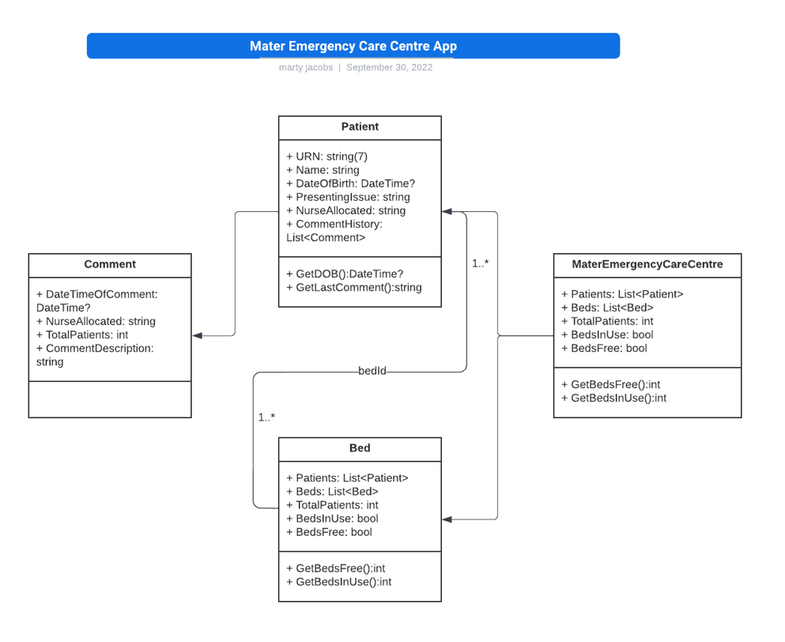

# Mater Emergency Care Centre App 🏥

Demo: https://witty-glacier-0a744e500.1.azurestaticapps.net/

## Description of Solution 

This app follows cloud native principles, taking advantage of the distributed computing offered by the Azure cloud delivery model. The application is written in C# and is built using Blazor WebAssembly, a free and open-source web framework that enables developers to create web apps using C# and HTML. Developed by Microsoft. This application draws from the cloud services offered in the Azure environment, and GitHub Actions, enabling the setup of a full CI/CD pipeline.

- <b>Compute</b> - The app is deployed using Azure Static Web Apps
- <b>Database</b> - The database is Azure Table Storage (a flexible NoSQL storage option)
- <b>API</b> - A C# Azure Functions API, which the Blazor application uses to interoperably communicate between components 
- <b>Web Frameworks</b> - Microsoft Blazor, MudBlazor (Front-end CSS framework), Bootstrap, HTML/CSS

The data modelling and classes have been seperated into a Shared project, to allow for both the front-end and API layer to access the models.  

The unique differences in the system design, and a key principle followed in the design of the database was to maintain a 1-to-1 relationship between Beds and Patients. This was represented as an integer, or "partition key" inside Azure Storage Table. The tables created were, MaterEmergencyCareCentre, Beds, Patients, and Comments. The relationship between the data was related utilising the partition key, and the unique patient number (URN).  

Further details describe the system: 

## Design Considerations 

There are assumptions I have made which are as follows: 

- There are only 8 beds required to be supported by the system at this stage 
- I assume there will be more beds to be added later, if additional beds are added to the centre
- Names, Dates, and Details don't need to be cross-checked or verified and are assumed correctly entered
- No history is required to be stored or saved, such as an audit of past bed patients
- Timezone is flexible for the purpose of the task
- A user will click on the patient name in the summary to gather more details (on another page) 

## Installation and Testing

<b> Required Software </b>

- .NET SDK 6 and above
- Visual Studio 2022
- Git

To get started with the project, clone the repository via the command: 

`git clone https://github.com/martyjacobsdev/MECC.git`

⚠️ The project API is currently not testable locally, this will affect the experience of the site.

However, the pages can still be navigated and front-end features, such as form validation and routing can be tested.

<b>Local Development</b>

- Open the BlazorStaticWebApps.sln with Visual Studio 2022 
- Set multiple startup projects, setting "Client" and "API" as startup projects
- Build & Run the application 
